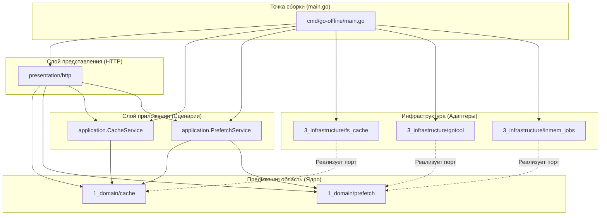

# Предметно-Ориентированное Проектирование (DDD) на примере `go-offline`

Это пошаговое и очень подробное руководство по архитектуре проекта `go-offline`. Проект не только решает задачи кэширования модулей Go, но и **идеально подходит в качестве учебного пособия для изучения DDD (Domain-Driven Design)** и **Чистой/Гексагональной Архитектуры** в Go.

Для большей наглядности учебного процесса ключевые директории (`application`, `infrastructure`) были названы полными именами (согласно канонам), чтобы явно отражать архитектурные слои.

---

## 1. Зачем здесь DDD и что это такое?

**Domain-Driven Design (Предметно-ориентированное проектирование)** — это подход к разработке, при котором структура кода и язык программистов (классы, функции, файлы) максимально близко повторяют язык самого бизнеса (предметную область или *Домен*).

**Ключевая идея:** Бизнес-логика (ядро системы, "Домен") не должна знать о том, какую базу данных вы используете (PostgreSQL, in-memory, файлы) или через какой протокол общаетесь (HTTP, gRPC, CLI). Домен должен зависеть только от самого себя!

В `go-offline` бизнес-сутью является работа с модулями Go, их версиями, фиксацией (pinning) и задачами на асинхронную загрузку. 

---

## 2. Четыре классических слоя

Если вы заглянете в `internal/`, то увидите четкое разделение на слои, которое предписывает Чистая архитектура:

```
internal/
├── 1_domain/        # Слой 1 — Ядро домена (Внутренний слой)
├── 2_application/   # Слой 2 — Слой приложения / Use Cases (Ранее: application/)
├── 3_infrastructure/# Слой 3 — Инфраструктурный слой (Ранее: infrastructure/)
└── 4_presentation/  # Слой 4 — Слой представления (Внешний слой)
```

> [!IMPORTANT]
> **Правило зависимостей (Dependency Rule)**: Внешние слои могут зависеть от внутренних, но **внутренние никогда не зависят от внешних**. Домен (`1_domain`) не знает про `2_application`, `3_infrastructure` или `4_presentation`! Он использует только стандартную библиотеку Go.

---

## 3. Тактические паттерны DDD в нашем коде

Давайте разберем основные "кирпичики" DDD на примерах файлов проекта.

### Ограниченные контексты (Bounded Contexts)
Обычно домен слишком сложен, чтобы держать всё в одной куче. Поэтому он дробится на независимые поддомены — ограниченные контексты. В `internal/1_domain/` их два:

1. **`cache`** — Контекст работы с реестром модулей, кэшем и зафиксированными версиями (pins).
2. **`prefetch`** — Контекст фоновой загрузки модулей (jobs, состояния, загрузчики). 

Между этими двумя контекстами нет жесткого связывания: они живут в соседних папках и ничего друг о друге глубоко не знают.

### Объекты-значения (Value Objects)
Это объекты, у которых **нет уникального идентификатора**. Их суть — лишь те данные, которые в них лежат. Если данные одинаковые, объекты считаются равными.
- **Пример:** `Module` (в `1_domain/cache/models.go`). Он описывает связку из названия модуля и версии (например, `fmt` и `v1.0.0`). Это всего лишь структура-носитель данных, она не меняет свое состояние.

### Сущности (Entities) и Агрегаты
Сущность имеет **уникальный ID** и может изменять своё состояние с течением времени. Часто Сущность берёт на себя роль Агрегата (Aggregate Root), который гарантирует консистентность своих данных изнутри, пряча их.
- **Пример:** `JobState` (в `1_domain/prefetch/models.go`).
  У `JobState` есть `ID`, и вы не можете просто поменять его статус `Status` напрямую, так как он защищён внутренним мьютексом (`mu sync.RWMutex`). Чтобы изменить статус, вы вызываете методы (действия предметной области): `Complete()` или `Fail()`. Это и есть настоящее ООП в стиле DDD — **скрытие данных (инкапсуляция) и выставление поведения.**

### Порты (Repository / Ports)
Внутри домена лежат только интерфейсы! Домен говорит: *"Мне нужен кто-то, кто умеет сохранять JobState, но мне всё равно, как он это сделает"*. Это называется Портом.
- **Пример:** Интерфейс `prefetch.JobRepository` или `cache.PinnedRepository` лежат в `1_domain`, а их реальный код (Адаптеры) — в `3_infrastructure`. 

---

## 4. Слой приложения (Application Layer)

Слой `internal/2_application/` оркестрирует работу домена. Здесь лежат так называемые **Сценарии Использования (Use Cases)**.
Например, в файле `prefetch_service.go` мы находим:
- `PrefetchModule(...)`
- `PrefetchGoMod(...)`

Что делает `PrefetchModule`? Он не содержит сложной доменной логики. Он действует как менеджер:
1. Создает сущность задачи через репозиторий: `job := s.jobsRepo.Create(...)`
2. Фиксирует модуль в другом контексте: `s.pinnedRepo.Pin(...)`
3. Вызывает инфраструктурный скачиватель: `s.downloader.DownloadModule(...)`
4. В зависимости от результатов просит сущность обновить статус: `job.Complete()` или `job.Fail()`

Заметьте: Сервис Приложения (Application Service) ничего не знает про HTTP-запросы и JSON. 

---

## 5. Инфраструктура (Infrastructure)

В папке `internal/3_infrastructure/` лежат Адаптеры — те самые штуки, которые знают, что такое жёсткий диск, оперативная память или запуск сторонних процессов (CLI).

- `3_infrastructure/fs_cache` — Умеет читать и писать JSON файлы на диск (Реализует доменный порт `PinnedRepository`).
- `3_infrastructure/inmem_jobs` — Хранит сущности задач (`JobState`) в `sync.Map` в оперативной памяти (Реализует доменный порт `JobRepository`).
- `3_infrastructure/gotool` — Знает, как дёргать реальную команду `go mod download` в операционной системе (Реализует доменный порт `Downloader`).

Никто в проекте напрямую эти пакеты не использует! Все зависят только от интерфейсов `1_domain`. Внедрение этих адаптеров происходит в самом начале работы программы.

---

## 6. Подключение (Dependency Injection) в main.go

Точка входа `cmd/go-offline/main.go` выступает в роли "Сборщика" (DI Container). Именно здесь разные, ничего не знающие друг о друге архитектурные слои, склеиваются вместе:

```go
// 1. Создаём инфраструктуру (Адаптеры)
downloader  := gotool.New(...)            // Способен качать
jobsRepo    := inmem_jobs.New()           // Способен хранить в памяти
pinnedRepo  := fs_cache.NewPinnedRepository(...) // Способен хранить на ФС

// 2. Создаём Application-сервисы, передавая им Адаптеры под видом Интерфейсов (Портов)
cacheSvc    := application.NewCacheService(..., pinnedRepo)
prefetchSvc := application.NewPrefetchService(downloader, jobsRepo, pinnedRepo, srv)

// 3. Создаём Presentation-слой (HTTP), передавая ему сервисы
srv := httphandlers.NewServer(ServerConfig{
    CacheSvc:   cacheSvc,
    JobsRepo:   jobsRepo,
    PinnedRepo: pinnedRepo,
})
```

---

## 7. Карта Зависимостей (Dependency Graph)

Ниже представлена диаграмма, показывающая идеальный поток зависимостей в проекте. Обратите внимание, что все стрелки направлены строго от окраин к центру (Домену).



---

## Резюме: Почему это отличный старт для изучения DDD?

1. **Нет глобального состояния (`var DB ...`)**: Все зависимости прокидываются через аргументы конструкторов (Dependency Injection).
2. **Инкапсуляция поведения**: Вы не найдёте файла, где в мапе напрямую менялось бы поле `JobState.Status = "done"`. Код заставляет вас обращаться к методу `job.Complete()`.
3. **Отделение "Что" от "Как"**: Домен говорит *"Нам нужно уметь сохранять зафиксированные модули"*. Инфраструктура отвечает за то, *как* это будет сделано (через JSON-файл в `fs_cache`). Вы можете легко заменить `fs_cache` на базу данных (PostgreSQL), добавив пакет `3_infrastructure/postgres_cache` — и **вам не придётся менять ни строчки кода ни в Домене, ни в Application-слое!** Это и есть магия Чистой архитектуры.
