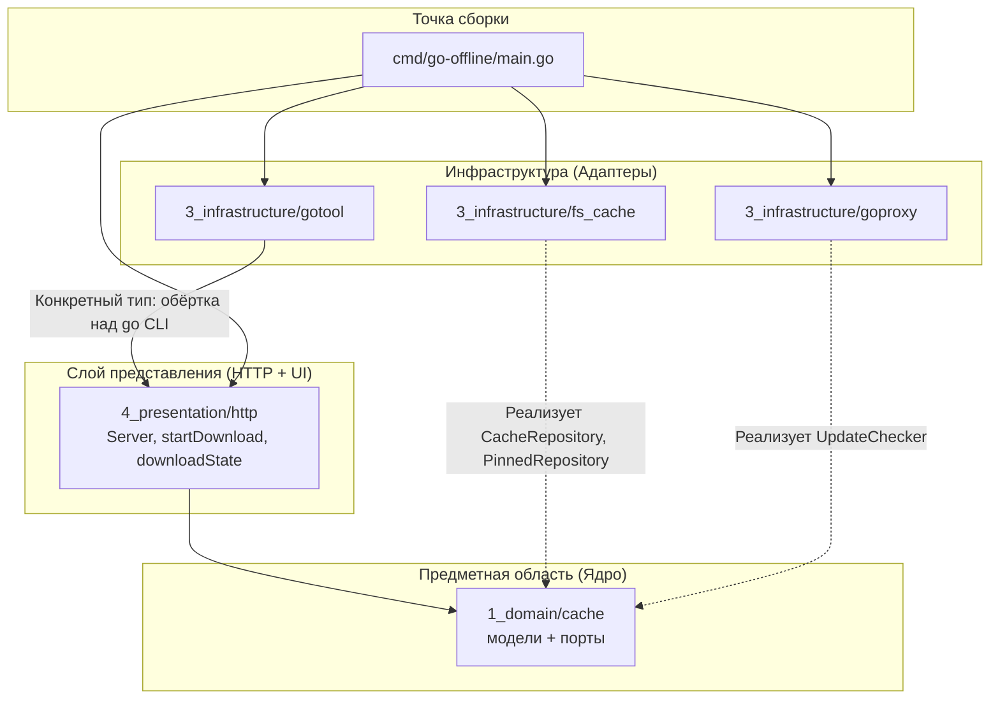

# Предметно-Ориентированное Проектирование (DDD) на примере `go-offline`

Это подробный разбор архитектуры проекта `go-offline`. Проект решает задачу кэширования модулей Go для офлайн-среды и заодно **неплохо подходит как учебное пособие по DDD (Domain-Driven Design)** и **Чистой/Гексагональной архитектуре** в Go.

Ключевые директории пронумерованы (`1_domain`, `3_infrastructure`, `4_presentation`), чтобы номер слоя был виден прямо в пути импорта.

---

## 1. Зачем здесь DDD и что это такое?

**Domain-Driven Design** — подход, при котором структура кода повторяет язык предметной области.

**Ключевая идея:** бизнес-логика (ядро системы, «Домен») не должна знать, где лежат данные (файлы, БД, память) и по какому протоколу с системой общаются (HTTP, gRPC, CLI). Домен зависит только от самого себя.

В `go-offline` предметная суть — модули Go, их версии, закрепление (pinning) нужных пользователю версий, экспорт/импорт кэша и проверка обновлений в апстриме.

---

## 2. Слои: три из четырёх

Загляните в `internal/`:

```
internal/
├── 1_domain/         # Слой 1 — Ядро домена: модели и порты (интерфейсы)
├── 3_infrastructure/ # Слой 3 — Адаптеры: ФС, сеть, запуск go CLI
└── 4_presentation/   # Слой 4 — Внешний слой: HTTP, отдача GOPROXY, встроенный UI
```

Слоя `2_application` **нет**, и это осознанное решение — см. раздел 4.

> [!IMPORTANT]
> **Правило зависимостей (Dependency Rule)**: внешние слои зависят от внутренних, но **внутренние никогда не зависят от внешних**. `1_domain` не знает про `3_infrastructure` и `4_presentation` и не импортирует ничего, кроме стандартной библиотеки.

---

## 3. Тактические паттерны DDD в нашем коде

### Ограниченный контекст (Bounded Context)

В `internal/1_domain/` он сейчас один — `cache`. Он покрывает реестр закэшированных модулей, закреплённые версии и отчёт о доступных обновлениях. Дробить его на несколько контекстов пока не за чем: у этих понятий общий язык и общий жизненный цикл.

### Объекты-значения (Value Objects)

Объекты без идентификатора: равны, если равны их данные.

- `cache.Module` (`1_domain/cache/models.go`) — связка «модуль + версия» с парой флагов (`Pinned`, `Exported`).
- `cache.PinnedEntry` — что и когда закрепил пользователь.
- `cache.ModuleUpdate` / `cache.UpdatesReport` — результат проверки обновлений: снимок ответа, а не изменяемая сущность.

Все они — неизменяемые носители данных. Сущностей (Entities) с собственным идентификатором и жизненным циклом в домене сейчас нет: система хранит состояние в файлах, а не в объектах.

### Порты (Ports)

Внутри домена лежат только интерфейсы. Домен говорит: *«мне нужен кто-то, кто умеет складывать модули в кэш»* — и не знает, как это сделано. Все три порта живут в `1_domain/cache/repository.go`:

| Порт | Что обещает | Кто реализует |
| --- | --- | --- |
| `CacheRepository` | перечислить кэш, экспортировать/импортировать архив, отдать путь для проксирования | `3_infrastructure/fs_cache` |
| `PinnedRepository` | закрепить/открепить, перечитать с диска, слить списки | `3_infrastructure/fs_cache` |
| `UpdateChecker` | спросить у апстрима, есть ли версии новее | `3_infrastructure/goproxy` |

Там же живёт доменная ошибка `cache.ErrNoNewFiles` — «в инкрементальный экспорт нечего класть». Это часть языка предметной области, а не деталь реализации tar-архива, поэтому её место в домене.

---

## 4. Почему нет слоя приложения (и почему это нормально)

Раньше здесь были `2_application` с `CacheService`/`PrefetchService` и доменный контекст `prefetch` с сущностью-задачей `JobState`, репозиторием задач и адаптером `inmem_jobs`. Всё это удалено.

Причина простая: сервисы не делали ничего, кроме проброса вызова из HTTP-обработчика в репозиторий, а система задач моделировала очередь, которой не существует — сервер выполняет **одну** загрузку за раз. Слой, который только пересказывает вызов, не изолирует домен, а лишь удлиняет путь до него.

Что осталось вместо этого:

- Оркестрация сценария живёт в обработчике. `Server.startDownload` (`4_presentation/http/handlers.go`) занимает единственный слот загрузки, заводит `context` с отменой, запускает горутину и по её завершении переводит состояние в `done`/`error`.
- Состояние выполняемой работы — `downloadState` в `4_presentation/http/server.go`: статус, логи, время старта и функция отмены под мьютексом. Это тот самый `JobState`, но без репозитория и без идентификаторов, потому что задача всегда одна.
- Порядок шагов сценария остался осмысленным: закрепление делается **после** успешной загрузки и той версией, к которой разрезолвился запрос, — иначе опечатка в имени модуля осталась бы закреплённой навсегда.

Правило для будущих изменений: `2_application` стоит вернуть тогда, когда у сценария появится второй вызывающий (CLI, планировщик) или своя логика поверх нескольких портов. Пустой слой «для канона» — это не чистая архитектура, а церемония.

---

## 5. Инфраструктура (Infrastructure)

В `internal/3_infrastructure/` лежат адаптеры — код, который знает про диск, сеть и сторонние процессы.

- **`fs_cache`** — реализует `CacheRepository` и `PinnedRepository`. Умеет обходить `cache/gomodcache/cache/download`, собирать `tar.gz`, вести `.export-state.json` (что уже уезжало) и хранить закрепления в `user-packages.json` под `sync.RWMutex`.
- **`goproxy`** — реализует `UpdateChecker`. Ходит на `/@latest` апстрима, отдельно нащупывает новые мажоры (они живут по другим путям модуля: `.../v2`, `.../v3`), проверяет модули пачками по 8 штук и кэширует отчёт на TTL. Кэш сбрасывается сам, если изменился набор закреплённых модулей — за это отвечает `fingerprint()`.
- **`gotool`** — реализует загрузку. Не переизобретает протокол модулей, а запускает настоящий `go` с `GOMODCACHE`, направленным в наш кэш: `go mod download`, `go list -m -json all` для графа сборки, `go mod graph` для догрузки `go.mod` всех рёбер графа.

Обратите внимание: `gotool.Downloader` — единственная зависимость, которую презентационный слой держит **конкретным типом**, а не интерфейсом. Это сознательное отступление: сценарий загрузки описывается тем, что умеет `go` CLI, и абстракция над ним была бы копией его же сигнатур.

---

## 6. Подключение (Dependency Injection) в main.go

Точка входа `cmd/go-offline/main.go` — «сборщик» (DI Container). Именно здесь слои, ничего не знающие друг о друге, склеиваются вместе:

```go
// 1. Создаём инфраструктуру (Адаптеры)
downloader    := gotool.New(*goBin, *workDir, *cacheDir)          // умеет качать через go CLI
pinnedRepo, _ := fs_cache.NewPinnedRepository(*cacheDir)          // умеет хранить пины на ФС
cacheRepo     := fs_cache.NewCacheRepository(*cacheDir, *workDir) // умеет читать кэш и паковать архив
updateChecker := goproxy.NewUpdateChecker(upstreamURL, httpClient, *updatesTTL)

// 2. Создаём Presentation-слой, передавая адаптеры под видом портов
srv := httphandlers.NewServer(httphandlers.ServerConfig{
    CacheDir:      *cacheDir,
    WorkDir:       *workDir,
    Upstream:      upstreamURL,
    HttpClient:    httpClient,
    Downloader:    downloader,
    CacheRepo:     cacheRepo,     // cache.CacheRepository
    PinnedRepo:    pinnedRepo,    // cache.PinnedRepository
    UpdateChecker: updateChecker, // cache.UpdateChecker
})

// 3. Роутинг
mux := http.NewServeMux()
srv.RegisterRoutes(mux)
```

Поля `CacheRepo`, `PinnedRepo` и `UpdateChecker` в `ServerConfig` объявлены доменными интерфейсами — сервер не знает, что за ними стоят файлы и HTTP.

---

## 7. Карта зависимостей (Dependency Graph)

Все стрелки направлены от окраин к центру (Домену).


```mermaid
graph TD
    subgraph CMD ["Точка сборки"]
        MAIN["cmd/go-offline/main.go"]
    end

    subgraph PRESENTATION ["Слой представления (HTTP + UI)"]
        HTTP["4_presentation/http<br/>Server, startDownload, downloadState"]
    end

    subgraph INFRASTRUCTURE ["Инфраструктура (Адаптеры)"]
        FSC["3_infrastructure/fs_cache"]
        GP["3_infrastructure/goproxy"]
        GT["3_infrastructure/gotool"]
    end

    subgraph DOMAIN ["Предметная область (Ядро)"]
        DC["1_domain/cache<br/>модели + порты"]
    end

    HTTP --> DC
    FSC -.->|Реализует CacheRepository, PinnedRepository| DC
    GP -.->|Реализует UpdateChecker| DC
    GT -->|Конкретный тип: обёртка над go CLI| HTTP

    MAIN --> HTTP & FSC & GP & GT
```

---

## 8. Поток одного сценария: prefetch модуля

Полезно проследить путь запроса целиком — видно, кто за что отвечает.

1. `POST /api/prefetch` попадает в `handlePrefetch` (`4_presentation/http/handlers.go`): разбор JSON, валидация, резолв пути пакета в путь модуля.
2. `startDownload` занимает единственный слот и уходит в горутину; клиент сразу получает `202 Accepted` (или `409`, если загрузка уже идёт).
3. В горутине `gotool.Downloader` создаёт временный модуль в `workdir/tmp`, качает цель, затем весь граф сборки и `go.mod` всех рёбер графа. Каждая строка вывода `go` уходит в `logf`.
4. После успеха — `pinnedRepo.Pin(module, resolvedVersion)`: закрепляется реальная версия, а не `latest`.
5. UI опрашивает `GET /api/download-status` и показывает статус с логом; `POST /api/download-cancel` дёргает `context.CancelFunc`, сохранённую в `downloadState`.

Домен в этом потоке не участвует напрямую — он задаёт словарь (`Module`, `PinnedEntry`) и контракт (`PinnedRepository`), которым пользуются остальные.

---

## Резюме: что здесь стоит подсмотреть

1. **Нет глобального состояния.** Все зависимости приходят через конструкторы (DI), а изменяемое состояние заперто за мьютексами в конкретных структурах (`pinnedRepository`, `downloadState`, `UpdateChecker`).
2. **Отделение «что» от «как».** Домен говорит: «надо уметь хранить закреплённые модули». Инфраструктура решает, что это JSON-файл. Замените `fs_cache` на `3_infrastructure/postgres_cache` — и ни домен, ни обработчики менять не придётся.
3. **Слои соответствуют реальности.** Слой приложения и система задач были удалены, когда выяснилось, что они ничего не изолируют. Архитектура — это набор решений, которые надо пересматривать, а не набор папок, которые надо завести один раз.
